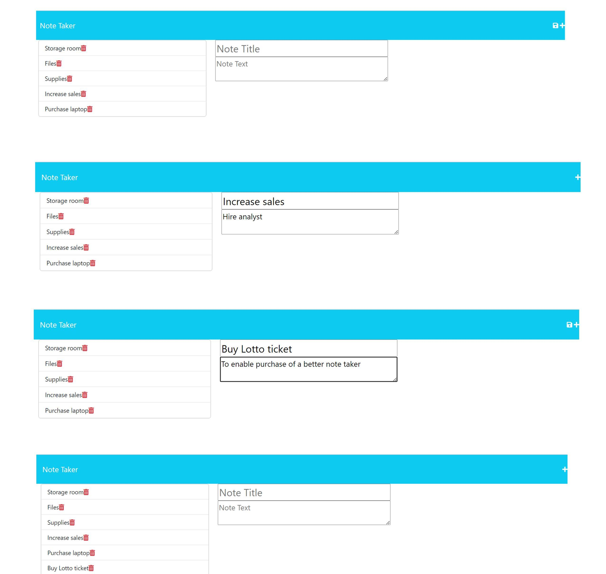

# NoteTaker
Note Taker using JSON file, Express.JS and deployed in Heroku

This is a Note Taking application for a small business owner.
In this note taker, the user is able to write and save notes so that a business owner can keep track of tasks 
they need to complete.
When the application is launched, the user is presented with a landing page with a link to a notes page.
The user is presented with a list of current notes in a page.
The current notes are on the left-hand column with empty fields on the right side column.
The user has the ability to add more notes and saving the notes using the disk icon.
Once saved, the note is listed on the left-hand side column.
When an existing task is selected, the note will appear on the right-hand side column.
When the user selects the plus icon, the user sees empty fields to add a new note title and text.

The files included are as follows:
server.js
package.json
package-lock.json
.gitignore
.db/db.json
/assets/styles/styles.css
/assets/notetakerscreen1.jpg
/public/scripts/index.js
/public/index.html
/public/notes.html
license
/readme.md

The github repository is:
https://github.com/agentpj/NoteTaker

Screencastify link:
https://drive.google.com/file/d/1c8ZgzR2xQzKseRa9tBYHJEIr9aEZFZIm/view

Heroku git url:
https://git.heroku.com/secure-brook-71656.git

